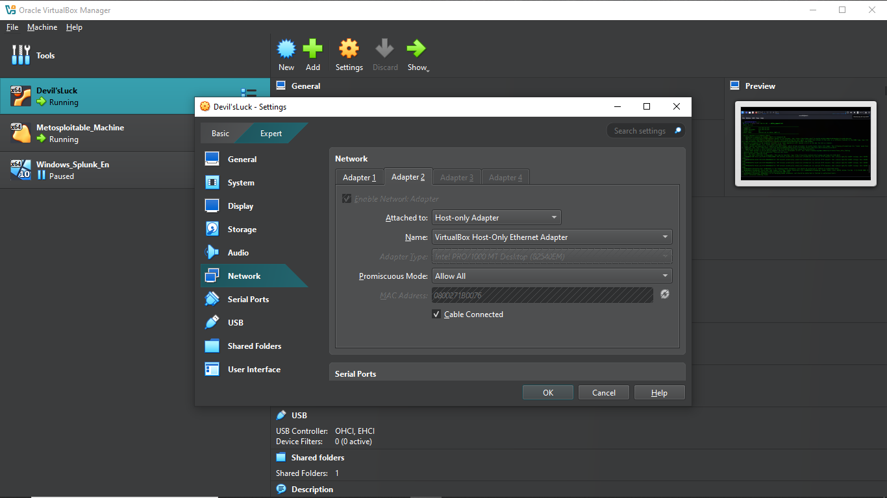

# ⚙️ Lab Setup

---

## 🔧 VM Environment

| Machine        | OS / Tool          | Purpose                        |
|----------------|--------------------|--------------------------------|
| Kali Linux     | Kali Rolling       | Attacker – Run brute-force, scans |
| Metasploitable | Metasploitable 2   | Vulnerable Target – Simulate weak services |
| Windows        | Splunk Enterprise  | Monitor logs & trigger alerts |

---

## 🔗 Network Setup (VirtualBox or VMware)

Each VM uses two network adapters:

- **Adapter 1 (NAT)**: For Internet access  
  

- **Adapter 2 (Host-Only)**: For isolated communication  
  

---

## 🧠 IP Address Allocation

| Machine        | IP Address        |
|----------------|------------------|
| Kali Linux     | `192.168.56.103` |
| Metasploitable | `192.168.56.105` |
| Splunk (Win)   | `192.168.56.104` |

---

## 📝 Splunk Input Setup

Enable Splunk to receive logs via syslog on port 514:

1. Go to:  
   `Settings → Data Inputs → UDP → Add New`
2. Fill in:
   - **Port**: `514`
   - **Source Type**: `syslog`
   - **Index**: `linux_logs`

📸  


---

## 🧾 Rsyslog on Metasploitable

Edit the Rsyslog config to forward logs to the Splunk server:

```bash
sudo nano /etc/rsyslog.conf
