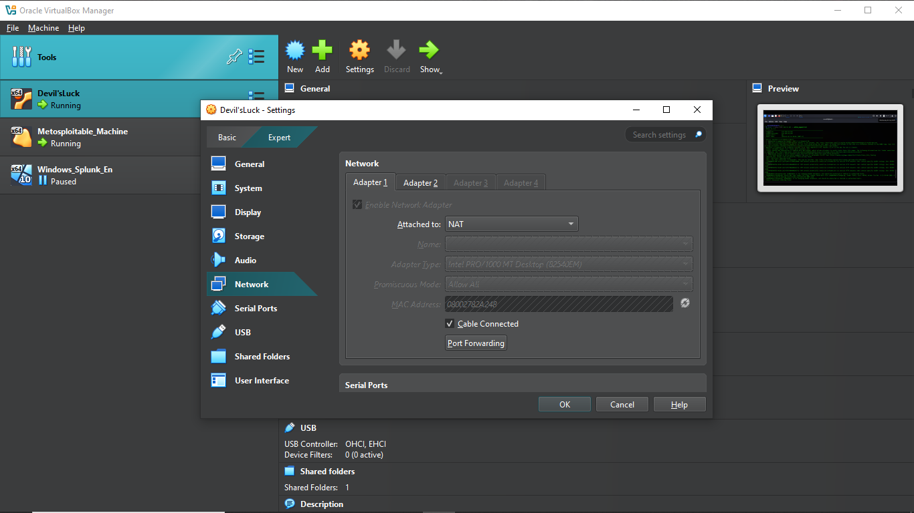
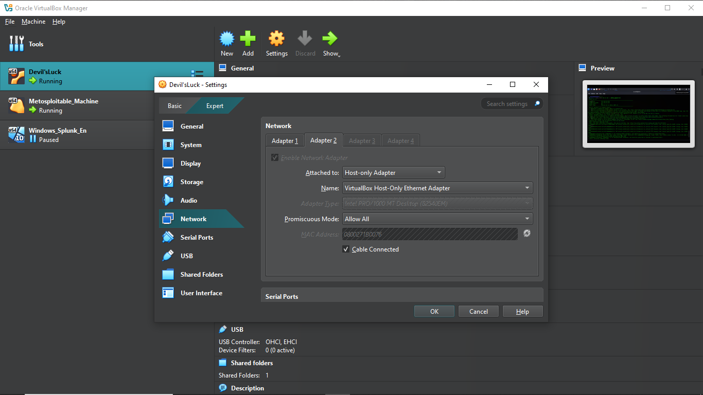

# 📸 Screenshot Index – Cyber Attack Monitoring Lab

This folder contains all visual proof (screenshots) of attack executions, log visibility in Splunk, dashboards, and alert configurations for the project.

---

### Lab Network Settings

**NAT Adapter:**

**Host-Only Adapter:**

---

## 💥 Step 02 – FTP Brute Force Attack

| Description | File |
|------------|------|
| Hydra running FTP brute-force | `hydra_ftp_attack.png` |
| FTP logs visible in Splunk | `ftp_log_in_splunk.png` |
| FTP dashboard panel in Splunk | `ftp_dashboard_panel.png` |
| Alert triggered from brute-force | `ftp_alert_triggered.png` |

---

---

## 🌐 Step 03 – Nikto Web Scan Attack

| Description | File |
|------------|------|
| Nikto scan command from Kali | `nikto_scan_kali.png` |
| Nikto GET/HEAD logs in Splunk | `nikto_logs_in_splunk.png` |
| Nikto panel on dashboard | `nikto_dashboard_panel.png` |
| `/phpinfo.php` alert triggered | `phpinfo_alert.png` |

---

## 📊 Step 04 – Dashboard Monitoring

| Description | File |
|------------|------|
| Full Splunk dashboard | `custom_dashboard_overview.png` |
| FTP attack panel (zoomed view) | `individual_panel_ftp.png` |
| Nikto panel (zoomed view) | `individual_panel_nikto.png` |
| Splunk query example for FTP | `search_query_example.png` |

---

## 🔔 Step 05 – Alert Setup and Trigger

| Description | File |
|------------|------|
| Splunk alert list (triggered) | `alert_list_page.png` |
| Splunk alert save configuration | `alert_config_settings.png` |

---

